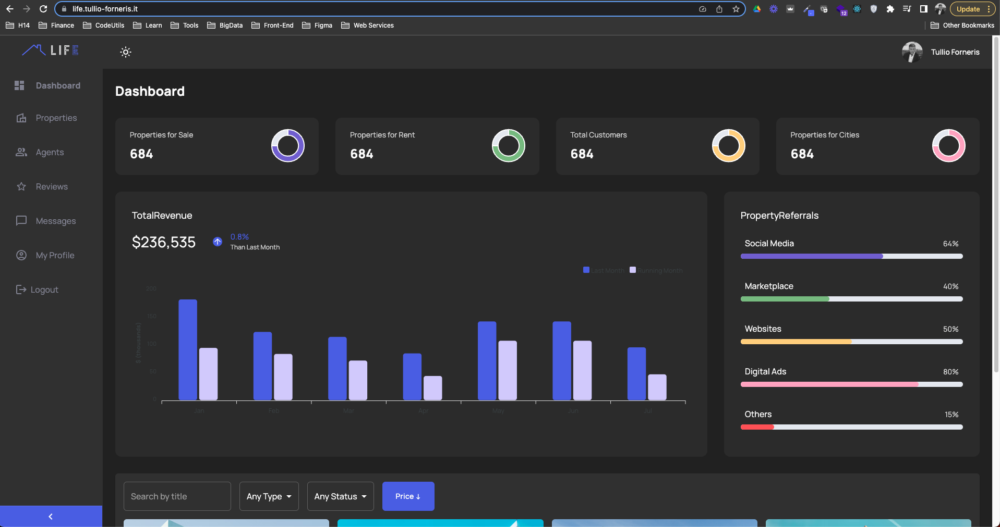
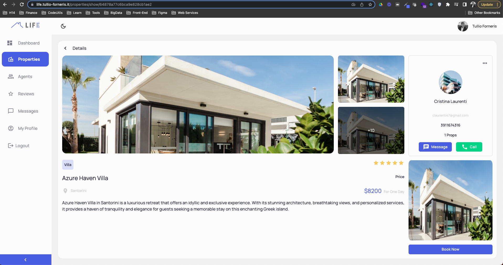

# Life | Real Estate

[Click Here](https://life.tullio-forneris.it) and try it!





Life is a real estate application that allows users to search for properties, view property details, and contact the listing agents/owners.

### Technologies

- Node.js, Express.js, MongoDB, and React.js (MERN stack).
- Material UI: The most popular UI Component Kit nowadays.
- TypeScript: the code base programming language.
- Cloudinary: to optimize images and store them on the cloud. 
- Google Auth: Provide a quick and easy way for your users to log in and register. 
- Refine: Most importantly, to build React-based CRUD applications quickly.
- Hostinger and Render: to deploy the application.
- Git and GitHub: to manage the source code.
- Intellij Idea: to write the code.
- Figma: to convert a design in a real App.

### [Keep Updated](https://linkedin.com/in/tullio-forneris) --> Follow me on LinkedIn
### [Let's collaborate](https://github.com/sonotullio) --> Follow me on GitHub
### [Other Projects](https://tullio-forneris.it) --> Take a look at my portfolio, you will find all my projects, my ideas, my contacts!

<div align="center" style="margin: 30px;">
    <a href="https://refine.dev">
    
    </a>
</div>
<br/>

This [refine](https://github.com/pankod/refine) project was generated with [superplate](https://github.com/pankod/refine).

## Getting Started

**refine** is a React-based framework for building data-intensive applications in no time ✨

Refine offers lots of out-of-the box functionality for rapid development, without compromising extreme customizability. Use-cases include, but are not limited to admin panels, B2B applications and dashboards.

## Available Scripts

### Running the development server.

```bash
    npm run dev
```

### Building for production.

```bash
    npm run build
```

### Running the production server.

```bash
    npm run start
```

## Learn More

To learn more about **refine**, please check out the [Documentation](https://refine.dev/docs)

- **REST Data Provider** [Docs](https://refine.dev/docs/core/providers/data-provider/#overview)
- **Material UI** [Docs](https://refine.dev/docs/ui-frameworks/mui/tutorial/)
- **Inferencer** [Docs](https://refine.dev/docs/packages/documentation/inferencer)
- **React Router** [Docs](https://refine.dev/docs/core/providers/router-provider/)
- **Google Auth Provider** [Docs](https://refine.dev/docs/core/providers/auth-provider/)
- **i18n** [Docs](https://refine.dev/docs/core/providers/i18n-provider/)
- **Permissions** [Docs](https://refine.dev/docs/core/plugins/permissions/)
- **Hooks** [Docs](https://refine.dev/docs/core/hooks/use-params/)
- **Layouts** [Docs](https://refine.dev/docs/core/plugins/layouts/)
